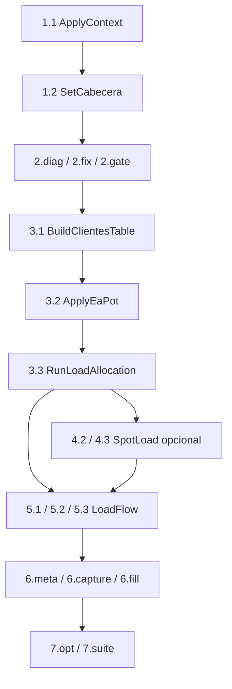

# Campaign Aggregate RECYM v7 (§§1–7)

Dominio de campaña por alimentador. Complementa [`ARQUITECTURA.md`](ARQUITECTURA.md) y [`FLUJO_TRABAJO.md`](FLUJO_TRABAJO.md).

Código: `src/domain/campaign.py`, `src/app/ledger.py`, `src/app/orchestrator.py`, `src/api_app/routers/campaign.py`.

## Agregado

```text
Campaign {
  campaign_id, feeder_id, status,
  binding: { database_mdb, study_path, ui_study_path, network_id },
  steps: { "1.1" | "1.2" | … | "7.suite" → StepState }
}
StepState: pending | ready | running | ok | skipped | blocked | error
```

Persistencia: SQLite `data/system/campaigns.db` (jobs + campaigns). Compatible Python 3.7 estación CYME.  
Cola externa Dramatiq+Redis: evolución cuando el runtime API sea ≥3.8; hoy el **Cyme Actor** sigue siendo el aislamiento serial (`cympy_isolation`, concurrency efectiva = 1).

## Máquina de estados



### Reglas

| Regla | Detalle |
|-------|---------|
| §4 opcional | Sin SpotLoad → `skip-spot` o dejar 4.* en ready; 5.1/5.2 no se bloquean |
| Tras §4 | No re-ejecutar 3.3 (orquestador rechaza) |
| §5 → §6 | Hace falta situacional **y** proyectado OK |
| 6.fill | Nunca abre Cyme; capturas solo `6.capture` |
| 1.2 guardar | Limpia sesión §§3–5 (política existente) |

## API v2

| Método | Ruta | Uso |
|--------|------|-----|
| GET | `/api/v2/campaigns/{feeder}` | Estado + catálogo de steps |
| POST | `/api/v2/campaigns/{feeder}/commands` | `{ "command": "RunLoadFlow", "params": { "scenario": "situacional" } }` |
| POST | `/api/v2/campaigns/{feeder}/skip-spot` | Marca 4.2/4.3 skipped |
| GET | `/api/v2/jobs/{job_id}` | Job en ledger |

Jobs legacy `POST /api/jobs` siguen funcionando y **actualizan** el ledger/campaign automáticamente.

## Commands ↔ cola

| Command | Step | Cola lógica |
|---------|------|-------------|
| ApplyContext | 1.1 | cyme |
| SetCabecera | 1.2 | cpu |
| DiagnoseNetwork / ApplyCorrections / EvaluateQualityGate | 2.* | cyme/cpu |
| BuildClientesTable / ApplyEaPot / RunLoadAllocation | 3.* | cpu/cyme |
| AddSpotLoad / AddSpotLoadBulk | 4.* | cyme |
| RunLoadFlow | 5.1–5.3 | cyme |
| SetInformeMeta / CaptureColorViews / FillInformeDoc | 6.* | cpu/cyme/cpu |
| OptimizeEquipment / SuiteTools | 7.* | cyme/cpu |
