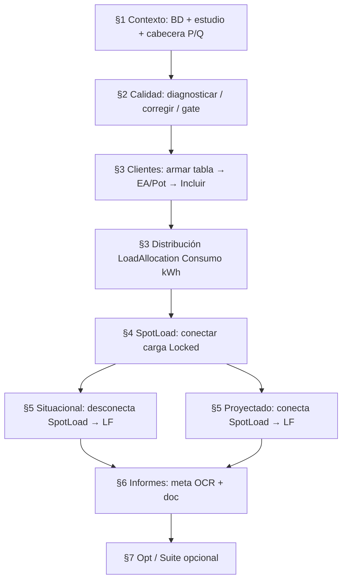

# Flujo de trabajo RECYM

Campaña típica por alimentador (referencia: **PA217**).  
UI: `scripts\20_demand_ui.bat` → http://127.0.0.1:5055  
Arquitectura: [`ARQUITECTURA.md`](ARQUITECTURA.md) · Manual: [`MANUAL_UI_DEMANDA.md`](MANUAL_UI_DEMANDA.md)

---

## Diagrama de campaña



---

## Preflight (una vez por máquina / día)

1. `scripts\01_check_environment.bat`
2. `scripts\03_test_cymdist_connection.bat --feeder <ID>`
3. Confirmar en `config/settings.json`:
   - rutas `studies_root`, `projects_dir`, `database_mdb`
   - `"dry_run": false` solo si se va a escribir al `.zxst`
4. Abrir SPA: `scripts\20_demand_ui.bat`

---

## Campaña interactiva (SPA)

### §1 — Contexto + cabecera

| Paso | Acción | Resultado |
|------|--------|-----------|
| 1.1 | Aplicar BD + estudio | Sesión CYMDIST alineada al alimentador |
| 1.2 | Medición cabecera (Excel) o P/Q manual → Guardar | Entrada Connected+Total (kW-kvar) para LoadAllocation |

Plantilla CYME al guardar/distribuir: Total ON, aguas abajo Consumo kWh, FdC 65 %, k = 0,3.

**Efecto lateral:** guardar cabecera limpia artefactos de sesión §§3–5.

### §2 — Calidad + Tablero

| Paso | Acción |
|------|--------|
| 2.x | Diagnosticar feeder → proponer → aplicar correcciones |
| Opcional | Diagnosticar sistema (96) / ELD |
| Gate | 0 Error/Warning/Hint + convergencia antes de §3 |

Tablero: `GET /api/tablero` (cards + códigos + clientes Incluir).

Jobs largos: `calidad_diagnosticar`, `calidad_aplicar`, `calidad_sistema`, `calidad_eld`, …

### §3 — Clientes importantes → SED

| Paso | Acción | Regla |
|------|--------|-------|
| 3.1 | Armar tabla (NIS) | Cruce suministro × clientes importantes |
| Incluir | On = escribe CYMDIST; Off = desconecta SED + 0 kW | Columna en Tablero §2 |
| 3.2 | Cargar EA/Pot | EA → Consumo (kWh); Pot → kW Locked |
| 3.3 | Distribución | Por Consumo (kWh); actualiza kW residual |

Tolerancias: `precision_tol_kwh`, `precision_tol_kw` en settings.

### §4 — SpotLoad concentrada

- Solo nodos **existentes** (no se crean nodos).
- Una carga (4.2) o lote CSV/Excel (4.3).
- P trifásica → A/B/C = P/3, Q/3; estado **Locked**.
- Genera figura de ubicación (`topologia.png`) cuando aplica.
- **No** volver a ejecutar §3.3 después de conectar SpotLoad.

### §5 — Flujos de carga

| Escenario | Comportamiento |
|-----------|----------------|
| Situacional | Desconecta SpotLoad §4 → LoadFlow |
| Proyectado | Conecta SpotLoad §4 → LoadFlow |
| General | LF sin conmutar escenario |

Motor: COM (`loadflow_engine: COM`). Tras OK se intenta refrescar insumos de §6.

### §6 — Informes de entrega

1. Meta desde PDF OCR (cliente, potencia_kw, …) o edición manual.
2. Requiere ambos flujos §5 + imágenes PNG.
3. Rellenar → `doc/informe.docx` (y PDF/preview según pipeline).

### §7 — Optimización + Suite

- Optimización: reclosers / regulators / capacitors.
- Suite: entorno, inventario, sync equipos, fix DEFAULT, export ASCII, nuevo feeder, pipeline batch.

---

## Campaña batch (CLI)

```bat
scripts\11_run_feeder.bat --feeder PA217
scripts\11_run_feeder.bat --all-feeders
```

Ejecuta `run_sequence` de `settings.json` (validar → diagnóstico → fixes → clientes → allocation → tablero).  
LoadFlow situacional/proyectado e informes suelen hacerse por UI (§§5–6) o scripts auxiliares (`scripts\_run_lf_informe.py`, etc.).

---

## Matriz “qué toca qué”

| Acción | Escribe `.zxst` | Toca BD `.mdb` | Artefactos `data/output` |
|--------|-----------------|----------------|--------------------------|
| §1 aplicar / cabecera | Sesión / params red | Lectura | demand/session, cabecera |
| §2 correcciones | Sí (si dry_run=false) | Equipos vía estudio | diagnostics/ |
| §3 EA/Pot + Incluir | Sí | — | clientes/ |
| §3 distribución | Sí (kW residual) | — | demand/allocation* |
| §4 SpotLoad | Sí | — | clientes/cargas, informe_images |
| §5 LoadFlow | Escenario on/off SpotLoad | — | demand/loadflow_* |
| §6 informe | No (docs) | — | demand/informe_meta, doc/ |

---

## Criterios de cierre de campaña

- [ ] Gate §2 limpio (o excepciones documentadas)
- [ ] Clientes Incluir = política acordada; EA/Pot verificados
- [ ] Distribución §3.3 OK (tolerancias)
- [ ] SpotLoad §4 en estudio (si aplica) y Locked
- [ ] LoadFlow situacional **y** proyectado OK
- [ ] Informe §6 rellenado (docx/pdf)
- [ ] Backup `.zxst` si `auto_backup: true`

---

## Restablecer UI / sesión

- Botón **Restablecer** en SPA → `POST /api/ui/reset`
- O `scripts\27_restablecer_ui.bat`
- **Actualizar** → `POST /api/ui/actualizar` (limpia tablero en memoria/disco según contrato)
