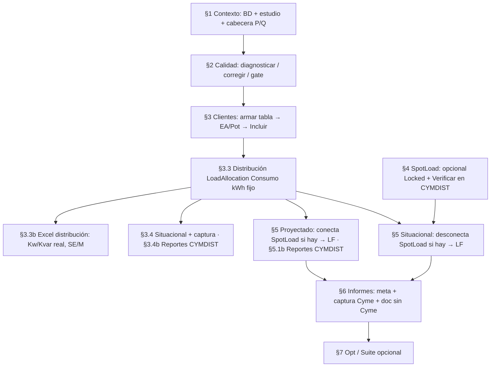

# Flujo de trabajo RECYM

Campaña típica por alimentador (referencia: **PA217**).  
UI: `Abrir RECYM.bat` (acceso directo del Escritorio) o `scripts\20_demand_ui.bat` → http://127.0.0.1:5055
Arquitectura: [`ARQUITECTURA.md`](ARQUITECTURA.md) · Campaign v7: [`CAMPAIGN_V7.md`](CAMPAIGN_V7.md) · Manual: [`MANUAL_UI_DEMANDA.md`](MANUAL_UI_DEMANDA.md)

---

## Diagrama de campaña


```mermaid
flowchart TD
  A[§1 Contexto: BD + estudio + cabecera P/Q] --> B[§2 Calidad: diagnosticar / corregir / gate]
  B --> C[§3 Clientes: armar tabla → EA/Pot → Incluir]
  C --> D[§3.3 Distribución LoadAllocation Consumo kWh fijo]
  D --> D2[§3.3b Excel distribución: Kw/Kvar real, SE/M]
  D --> D3[§3.4 Situacional + captura · §3.4b Reportes CYMDIST]
  E[§4 SpotLoad: opcional Locked + Verificar en CYMDIST] --> F1
  D --> F1[§5 Situacional: desconecta SpotLoad si hay → LF]
  D --> F2[§5 Proyectado: conecta SpotLoad si hay → LF · §5.1b Reportes CYMDIST]
  F1 --> G[§6 Informes: meta + captura Cyme + doc sin Cyme]
  F2 --> G
  G --> H[§7 Opt / Suite opcional]
```

**Estado vivo:** `GET /api/v2/campaigns/{feeder}` (gates ready/blocked/ok).

---

## Preflight (una vez por máquina / día)

1. `scripts\01_check_environment.bat`
2. `scripts\03_test_cymdist_connection.bat --feeder <ID>`
3. Confirmar en `config/settings.json`:
   - rutas `studies_root`, `projects_dir`, `database_mdb`
   - `"dry_run": false` solo si se va a escribir al `.zxst`
4. Abrir SPA: `Abrir RECYM.bat` (acceso directo del Escritorio) o `scripts\20_demand_ui.bat`

---

## Campaña interactiva (SPA)

### Selección del escenario

En §1 seleccione una de estas rutas:

1. **Análisis de un alimentador:** complete una cabecera y continúe por §§2–7.
2. **Transferencia:** seleccione origen y receptor. §1 resuelve por separado código
  de medidor, medidor, Vll, Excel y P/Q/S máximo de ambos alimentadores; al confirmar
  1.1 carga las dos redes en CYMDIST y conserva un `scenario_id` propio.

No se reutilizan los valores de cabecera del origen para el receptor.

### §1 — Contexto + cabecera

| Paso | Acción | Resultado |
|------|--------|-----------|
| 1.1 | Aplicar BD + estudio | Sesión CYMDIST alineada al alimentador |
| 1.4 | Medición cabecera (Excel) o P/Q manual → Cargar en la fuente | Entrada Connected+Total (kW-kvar) para LoadAllocation |

Plantilla CYME al guardar/distribuir: Total ON, aguas abajo Consumo kWh, FdC 65 %, k = 0,3.

**Efecto lateral:** guardar cabecera limpia artefactos de sesión §§3–5.

### §2 — Calidad + Tablero

| Paso | Acción |
|------|--------|
| 2.x | Diagnosticar feeder → proponer → aplicar correcciones |
| Opcional | Diagnosticar sistema (96) / ELD |
| Gate | 0 Error/Warning/Hint + convergencia antes de §3 |

En un escenario de transferencia, registre aquí el nodo, el seccionador que se
abrirá y el interruptor/punto de enlace que se cerrará. Estos datos pasan a §5.

Tablero: `GET /api/tablero` (cards + códigos + clientes Incluir).

Jobs largos: `calidad_diagnosticar`, `calidad_aplicar`, `calidad_sistema`, `calidad_eld`, …

### §3 — Clientes importantes → SED

| Paso | Acción | Regla |
|------|--------|-------|
| 3.1 | Armar tabla (NIS) | Cruce suministro × clientes importantes |
| Incluir | On = escribe CYMDIST; Off = desconecta SED + 0 kW | Columna en Tablero §2 |
| 3.2 | Cargar EA/Pot | EA → Consumo (kWh); Pot → kW Locked |
| 3.3 | Distribución | **Método fijo Consumo (kWh)** — no configurable por payload (ver §6 `core/cymdist_com.py`); actualiza kW residual |
| 3.3b | Descargar distribución (Excel) | Kw/Kvar = demanda **real** leída del estudio (nunca energía/Pot contratada); SE sin consumo = REVISAR obligatorio, M (medidor gemelo) = informativo |
| 3.4 | Estado situacional + capturas nativas | LoadFlow situacional + coloreo VoltageLevel/LoadingLevel; si la captura sale bien el resultado queda **guardado** (no se restaura) |
| 3.4b | Reportes CYMDIST (sin proyecto) | Selección guardada en CYMDIST `RECYM_Informe` (Barras/Cables/Cargas + Flujo de carga) sobre el estado situacional → Excel en `informe_reportes/` |

Tolerancias: `precision_tol_kwh`, `precision_tol_kw` en settings.

**Nunca se inventa un valor** cuando falta un dato (kWh vacío, ConnectedKVA insuficiente): se marca
REVISAR/needs_review para corregir en la fuente, nunca se escribe un número fabricado
(ver 260044 `raise_connected_kva`, ahora solo lectura).

### §4 — SpotLoad concentrada

- Solo nodos **existentes** (no se crean nodos).
- Una carga (4.2) o lote CSV/Excel (4.3).
- P trifásica → A/B/C = P/3, Q/3; estado **Locked**.
- Genera figura de ubicación (`topologia.png`) cuando aplica.
- **No** volver a ejecutar §3.3 después de conectar SpotLoad.
- **Verificar en CYMDIST**: relee en vivo (COM, solo lectura) cada carga §4 contra el
  estudio activo — confirma que existe y está `Connected`, no solo que el CSV/sesión
  local lo diga. Columna *Verificado CYMDIST* en la tabla de cargas §4.

### §5 — Flujos de carga

Para transferencia, seleccione el sentido origen → receptor y el nodo manualmente.
La secuencia prevista es: abrir seccionador del origen, cerrar enlace, ejecutar
LoadFlow y revisar cargabilidad y caída de tensión antes de aceptar la maniobra.

| Escenario | Comportamiento |
|-----------|----------------|
| Situacional | Desconecta SpotLoad §4 **si existen** → LoadFlow |
| Proyectado | Conecta SpotLoad §4 **si existen** → LoadFlow |
| General | LF sin conmutar escenario |

§4 es **opcional**: sin SpotLoad, 5.1/5.2 corren sobre el modelo actual.  
Motor: COM (`loadflow_engine: COM`). Tras **5.2 proyectado** el job entrega el informe completo
(capturas CYMDIST de coloreo + Excel/Word/PDF). Tras 5.1 solo actualiza cuadros numéricos.

**5.1b · Reportes CYMDIST:** LoadFlow proyectado + captura nativa VoltageLevel/LoadingLevel
(con la carga nueva de §4 ya conectada) + selección guardada `RECYM_Informe` → Excel en
`informe_reportes/`. Análogo a 3.4b pero en escenario proyectado.

### §6 — Informes de entrega (autonómico)

Punto único de código: `pipeline.deliver_informe` (no requiere un agente externo).

| Vía | Cómo |
|-----|------|
| UI | Botón **Rellenar informes → doc** → `POST /api/informe/armar` (`force_captures` + fill) |
| Tras §5.2 | Job `flujo` con `update_informe=true` → `deliver_informe` |
| CLI | `.tools\python37-win32\python.exe -m pipeline.deliver_informe --feeder AL209 --ensure-lf` |
| Batch | `scripts\26_deliver_informe.bat AL209` |

Incluye: LoadFlow §5 si faltan (`ensure_lf`), 4 PNG VoltageLevel/LoadingLevel situacional+proyectado,
pérdidas/cuadros, leyendas, trafo, `doc/informe.docx` + PDF + preview.
Gate: ambos LF + 4 PNG live + meta (`require_delivery`).

**Revision OCR post-entrega (autonómica, hasta 3 ciclos):**

```
PDF → OCR revisión → (si falla) corregir Word → Word→PDF → OCR otra vez
```

Hasta 3 veces. Comprueba cuadros (kW sit/proy, pérdidas), capturas CYMDIST
(sidecar escenario, live, sit≠proy) y media embebida en Word.
Log: `doc/review_ocr.json`. API: `POST /api/informe/review_ocr`.

### §7 — Optimización + Suite

- Optimización: reclosers / regulators / capacitors.
- Suite: entorno, inventario, sync equipos, fix DEFAULT, export ASCII, nuevo feeder, pipeline batch.

---

## Campaña batch (CLI)

```bat
scripts\11_run_feeder.bat --feeder PA217
scripts\11_run_feeder.bat --all-feeders
```

Ejecuta `run_sequence` de `settings.json` (validar → diagnóstico → fixes → clientes → allocation → tablero).  
LoadFlow + informe completo: `scripts\26_deliver_informe.bat <FEEDER>` o campaña `scripts\run_cierre_1_7.py` (§5.2 + §6).

---

## Matriz “qué toca qué”

| Acción | Escribe `.zxst` | Toca BD `.mdb` | Artefactos `data/output` |
|--------|-----------------|----------------|--------------------------|
| §1 aplicar / cabecera | Sesión / params red | Lectura | demand/session, cabecera |
| §2 correcciones | Sí (si dry_run=false) | Equipos vía estudio | diagnostics/ |
| §3 EA/Pot + Incluir | Sí | — | clientes/ |
| §3 distribución | Sí (kW residual) | — | demand/allocation* |
| §4 SpotLoad | Sí | — | clientes/cargas, informe_images |
| §5 LoadFlow | Escenario on/off SpotLoad | — | demand/loadflow_* |
| §6 informe | No (docs) | — | demand/informe_meta, doc/ |

---

## Criterios de cierre de campaña

- [ ] Gate §2 limpio (o excepciones documentadas)
- [ ] Clientes Incluir = política acordada; EA/Pot verificados
- [ ] Distribución §3.3 OK (tolerancias)
- [ ] SpotLoad §4 en estudio (si aplica) y Locked
- [ ] LoadFlow situacional **y** proyectado OK
- [ ] Informe §6 rellenado (docx/pdf)
- [ ] Backup `.zxst` si `auto_backup: true`

---

## Restablecer UI / sesión

- Botón **Restablecer** en SPA → `POST /api/ui/reset`
- O `scripts\27_restablecer_ui.bat`
- **Actualizar** → `POST /api/ui/actualizar` (limpia tablero en memoria/disco según contrato)
